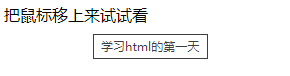

### HTML

#### 注释

1. 格式`<!-- 注释内容 -->`
2. vscode 中的快捷键`ctrl + /`

#### 元素

1. 元素 = 起始标记 + 元素属性 + 元素内容 + 结束标记
   - `<a href="http://www.baidu.com">百度一下</a>`
   - `<div class="wrapper"></div>`
2. 有些元素是没有结束标记的
   - `<meta charset="UTF-8" />`
   - ``
3. 不同的元素有不同的功能

##### a 标签

#### 属性

##### 局部属性

- 某些标签特有的属性

##### 全局属性

- 所有元素通用

1. title
   - 鼠标 hover 上去（移上去）的时候有个提示效果
   ```html
   <div title="学习html的第一天">把鼠标移上来试试看</div>
   ```
   **效果图**：
   
   
   

### CSS
